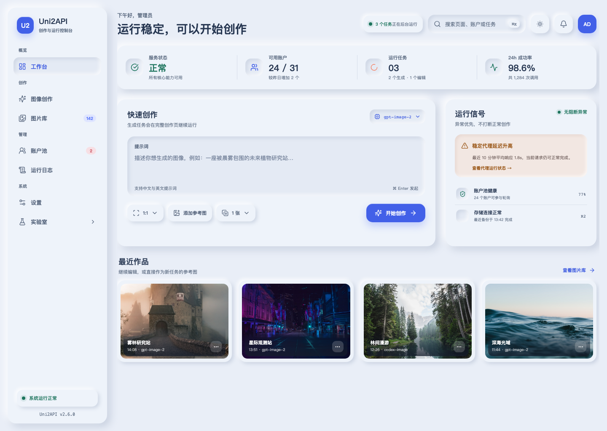

# Uni2API 前端完整重设计方案

> 版本：Concept v1.0  
> 日期：2026-07-12  
> 设计母版：管理员角色自适应工作台首页  
> 视觉方向：Balanced Soft UI / 云雾蓝 + 珊瑚

## 1. 设计目标

Uni2API 是一个同时承载 AI 图像创作与 API 运维管理的自托管控制台。新版前端不再把它表现为若干独立管理页面的集合，而是统一成一个角色自适应的“双核心工作台”：

- 创作核心：快速发起生成、继续会话、管理图片与参考素材。
- 运维核心：确认服务健康、管理账户池、定位失败任务、处理代理和额度异常。
- 管理员默认偏向运行状态，普通用户默认偏向创作流程；两种角色共享同一套导航、组件和视觉语言。

设计成功的判断标准：用户登录后 10 秒内能确认系统是否可用，并能在 30 秒内完成一次创作发起或进入明确的异常处理路径。

## 2. 已确认的设计决策

| 维度 | 决策 |
| --- | --- |
| 品牌名 | 全站统一为 `Uni2API` |
| 产品身份 | 创作与运维双核心控制台 |
| 角色策略 | 管理员与普通用户按角色自适应首页 |
| 导航 | 桌面常驻侧栏；平板收窄图标轨；手机抽屉 |
| 主题 | 浅色默认，完整深色配对，支持跟随系统和手动覆盖 |
| 视觉 | 平衡型 Soft UI，圆角、双向外阴影、局部内阴影 |
| 配色 | 云雾蓝主表面、钴蓝主操作、珊瑚创作强调 |
| 首页操作 | 正常时“开始创作”，阻断异常时切换为“处理异常” |
| 创作边界 | 首页快速发起，完整创作页承接进度、编辑与历史 |
| 移动端 | 核心流程完整；复杂批量管理有意识降级 |

## 3. 设计概念：Soft Signal Console

新版的记忆点不是科技渐变或装饰插画，而是“可触摸的运行信号”。页面像一台经过精细打磨的专业设备：主要表面从同一片云雾蓝底材中浮起，输入和选中状态轻微按入，钴蓝表示可执行动作，珊瑚表示创作相关强调，绿/黄/红只承担明确的运行状态。

Soft UI 只用于建立层级，不牺牲信息扫描：

- 页面外壳、侧栏、KPI 组、快捷创作和按钮使用双向柔影。
- 输入区、激活导航、分段控制和按下态使用内阴影。
- 表格、日志行和设置表单不逐项叠加重阴影，依靠间距、浅色分隔和行状态维持密度。
- 异常永远同时使用图标、标题、原因和行动入口，不依赖颜色单独表达。

## 4. 信息架构

### 4.1 全局导航

```text
Uni2API
├─ 工作台                 /                  角色自适应首页
├─ 创作
│  ├─ 图像创作            /image
│  └─ 图片库              /image-manager
├─ 管理（管理员）
│  ├─ 账户池              /accounts
│  └─ 运行日志            /logs
├─ 系统（管理员）
│  └─ 设置                /settings
└─ 实验室（管理员，折叠）
   └─ 调试                /debug
```

第三方无限画布不占用一级导航；它作为“创作”组内的外部应用入口显示，并在跳转前明确提示将传递的连接信息。

### 4.2 导航行为

- 桌面 `≥1280px`：侧栏宽 `232px`，常驻展开。
- 中等桌面/平板横屏 `768–1279px`：侧栏宽 `72px`，仅显示图标；悬停和聚焦显示文字提示。
- 手机 `<768px`：侧栏变为左侧抽屉，顶部栏保留菜单、当前页标题和用户菜单。
- `⌘K / Ctrl+K` 打开全局命令面板，可搜索页面、账户、任务 ID、设置项与常用动作。
- 返回上一页时恢复筛选条件、分页、滚动位置和输入草稿。

## 5. 管理员工作台首页

### 5.1 首屏布局

桌面采用 `侧栏 + 主工作区`。主工作区最大宽度 `1440px`，左右留白 `32px`，纵向间距以 `24px` 为主要节奏。

1. 顶部欢迎区：当前角色、系统结论、全局搜索、通知、主题和用户菜单。
2. 核心信号组：服务状态、可用账户、运行任务、24 小时成功率。
3. 主行动区：左侧快捷创作，右侧运行信号和异常处理。
4. 最近作品：4 个缩略图，提供继续编辑和用作参考图。
5. 最近活动：任务与关键系统事件的紧凑时间线，位于首屏之后。

### 5.2 状态自适应

| 系统状态 | 页面标题 | 主按钮 | 信号区优先级 |
| --- | --- | --- | --- |
| 正常 | 运行稳定，可以开始创作 | 开始创作 | 展示非阻断提醒 |
| 部分降级 | 部分能力受到影响 | 继续创作 / 查看影响 | 置顶受影响模型或代理 |
| 阻断 | 需要先处理运行异常 | 处理异常 | 展示原因、范围和修复路径 |
| 数据加载中 | 正在确认运行状态 | 保持按钮尺寸的骨架 | 对应模块骨架，不用整页旋转图标 |

### 5.3 快捷创作

首页只保留高频字段：提示词、模型、画幅、参考图、生成数量。高级质量、会话历史、多图编辑和结果管理留在完整创作页。

- 提示词区域支持 `⌘Enter / Ctrl+Enter` 发起。
- “开始创作”后立即创建任务并跳转 `/image?task=<id>`，不等待生成完成。
- 未完成输入自动保存为本地草稿；从首页进入创作页时继续保留。
- 如果系统阻断，按钮切换为“处理异常”，不允许创建必然失败的任务。

## 6. 页面级重设计

### 6.1 图像创作 `/image`

- 保留会话历史、结果画布、参数区三部分，但统一进入应用壳层。
- 桌面：会话栏 `280px`、结果区弹性宽度、参数检查器 `320px`。
- 提示词固定在结果区底部，输入面采用内阴影；运行任务以稳定尺寸的进度单元显示。
- 编辑模式通过分段控件切换，不另开页面；参考图以可排序缩略条呈现。
- 移动端依次呈现结果、提示词、关键参数，高级参数进入底部 Sheet。

### 6.2 图片库 `/image-manager`

- 顶部为搜索、日期、标签与视图切换；筛选条件以可移除的 chip 回显。
- 默认瀑布/自适应网格；选择后出现悬浮批量操作栏。
- 图片详情采用右侧检查器，不使用嵌套卡片；包括标签、尺寸、创建时间、来源任务与下载。
- 空状态直接给出“开始创作”，加载使用保留比例的缩略图骨架，避免布局跳动。

### 6.3 账户池 `/accounts`

- 首屏只保留可用、限流、失效、禁用四类摘要；点击摘要即应用筛选。
- 表格外层使用 Soft UI 容器，表格行保持轻量；状态、额度和恢复时间采用可排序列。
- 多选后显示悬浮批量操作栏：刷新、导出、启用/禁用、删除。
- 账户详情使用右侧 Sheet；危险操作与普通操作空间分离并二次确认。
- 导入流程统一成分步对话框：选择来源 → 填写/上传 → 验证预览 → 确认导入 → 进度结果。

### 6.4 运行日志 `/logs`

- 顶部固定过滤器：时间、级别、请求类型、账户、关键字和任务 ID。
- 日志主体优先使用虚拟化表格，等宽字体仅用于时间、ID、端点和代码片段。
- 行展开显示结构化详情；JSON 支持折叠、复制和自动换行。
- 错误行提供“查看关联账户”“查看任务”“复制诊断信息”快捷动作。

### 6.5 设置 `/settings`

- 现有 8 个横向标签改为二级设置导航：基础、备份、密钥、接口、画布、网络代理、CPA、Sub2API。
- 桌面采用左侧设置目录 + 右侧表单；手机采用单列可返回的设置页面。
- 配置项按语义分区，不把页面分区全部包成独立浮卡。
- 保存状态固定：未修改、已修改、保存中、已保存、保存失败；长表单支持离开确认。

### 6.6 调试实验室 `/debug`

- 从主导航降级到默认折叠的“实验室”，减少普通管理流程噪声。
- Skills、搜索、PPT、PSD、对话仍保留标签结构，但统一请求/响应检查器。
- 代码与 JSON 区域采用深色内嵌面板，不让整个应用切换成终端风。

### 6.7 登录页 `/login`

- 使用居中的单任务认证面板，品牌名统一为 Uni2API。
- 密钥字段提供显示/隐藏和粘贴反馈；错误紧邻字段，说明原因和恢复方法。
- 不增加营销内容、功能介绍或无关插画。

## 7. 视觉设计系统

### 7.1 色彩 tokens

#### 浅色主题

| Token | Hex | 用途 |
| --- | --- | --- |
| `--bg-canvas` | `#E9EEF7` | 页面统一软底 |
| `--surface-raised` | `#EEF3FA` | 浮起卡片与侧栏 |
| `--surface-sunken` | `#E4EAF4` | 输入和按入状态 |
| `--text-primary` | `#263651` | 主文字 |
| `--text-secondary` | `#53627A` | 次级文字 |
| `--text-muted` | `#5D6C82` | 辅助文字，满足普通文本对比度 |
| `--primary` | `#4260E8` | 主操作、选中与焦点 |
| `--primary-hover` | `#3F5CE0` | 主操作悬停 |
| `--creative-accent` | `#F28C73` | 创作强调、非阻断提醒 |
| `--success` | `#1D745D` | 正常与成功 |
| `--warning` | `#9B5819` | 警告 |
| `--danger` | `#C94C5A` | 错误与危险操作 |
| `--info` | `#3678B8` | 信息提示 |

彩色面积控制在 10–15%；钴蓝只用于可执行主操作和当前选中，珊瑚不作为普通装饰背景。

#### 深色主题

| Token | Hex | 用途 |
| --- | --- | --- |
| `--bg-canvas` | `#202633` | 页面背景 |
| `--surface-raised` | `#262D3B` | 浮起表面 |
| `--surface-sunken` | `#1B212C` | 按入表面 |
| `--text-primary` | `#F2F5FA` | 主文字 |
| `--text-secondary` | `#C3CBD8` | 次级文字 |
| `--primary` | `#8095FF` | 主操作与焦点 |
| `--creative-accent` | `#F2A18D` | 创作强调 |

深色主题不模拟亮白高光，改用顶部柔亮边缘、黑色环境阴影和轻微 `1px` 半透明描边维持层级。

### 7.2 阴影 tokens

```css
--shadow-raised-sm:
  -4px -4px 9px rgba(255, 255, 255, 0.78),
   4px  4px 9px rgba(134, 149, 178, 0.30);

--shadow-raised-md:
  -8px -8px 18px rgba(255, 255, 255, 0.82),
   8px  8px 18px rgba(134, 149, 178, 0.32);

--shadow-inset:
  inset -4px -4px 8px rgba(255, 255, 255, 0.72),
  inset  4px  4px 8px rgba(134, 149, 178, 0.24);

--shadow-primary:
  0 8px 16px rgba(66, 96, 232, 0.26);
```

规则：双向外阴影只在与 `--bg-canvas` 同色或近色表面上使用；表格行、chip 和小徽章不使用 `raised-md`；内阴影只表达输入、选中或按入状态。

### 7.3 圆角与尺寸

| Token | 值 | 用途 |
| --- | --- | --- |
| `--radius-xs` | `8px` | 紧凑数据、代码块 |
| `--radius-sm` | `12px` | chip、小按钮、表格容器内项 |
| `--radius-md` | `16px` | 输入、按钮、导航项 |
| `--radius-lg` | `20px` | 主卡片、侧栏 |
| `--radius-pill` | `999px` | 状态徽章、分段控件外壳 |

主控件高度 `44px`；图标按钮交互区域不小于 `44×44px`；桌面紧凑表格行高 `48–52px`。

### 7.4 排版

- 中文/UI 主字体：`Inter, "Noto Sans SC", system-ui, sans-serif`。
- 数据与代码：`Geist Mono, "JetBrains Mono", ui-monospace, monospace`。
- H1 `28/36 700`；H2 `22/30 650`；H3 `18/26 650`。
- 正文 `14/22 400`；控件 `14/20 550`；辅助信息 `12/18 500`。
- 数字使用 tabular figures；不使用负字距，不用全大写英文眉题作为页面模板。

### 7.5 间距

基础为 `4px`，常用阶梯：`4 / 8 / 12 / 16 / 20 / 24 / 32 / 40 / 48`。

- 页面边距：手机 `16px`、平板 `24px`、桌面 `32px`。
- 主卡片内距：桌面 `24px`、手机 `18px`。
- 相关控件间距 `8–12px`，模块间距 `20–24px`，页面章节间距 `32–40px`。

## 8. 组件规范

### 8.1 按钮

- 主按钮：钴蓝实色 + 主色阴影，`16px` 圆角；全屏每个区域只有一个主按钮。
- 次按钮：同背景浮起表面 + 双向小阴影。
- 幽灵按钮：仅用于低优先级工具，悬停时出现浅色底。
- 图标按钮使用 Lucide，统一 `18–20px`，默认 `1.75px` 描边。
- 按下：`transform: scale(0.98)` 并减弱外阴影；不会改变布局尺寸。

### 8.2 卡片和指标

- 只有独立信息或操作单元才使用卡片，不做卡片嵌套。
- KPI 采用一个分组容器内的四列单元，而不是四张重复悬浮卡。
- 可点击卡片悬停抬升 `2px`；静态卡片不做无意义动效。

### 8.3 输入与表单

- 始终显示 label；placeholder 只给示例，不替代标签。
- 默认表面轻微按入；聚焦加 `2px` 钴蓝 ring，不能只依赖阴影。
- 失焦后校验；错误紧邻字段并说明原因与解决方法。
- 保存中禁用重复提交并保持按钮宽高；保存成功使用短暂状态反馈。

### 8.4 表格

- 表格整体可使用 `20px` 圆角 Soft UI 容器，内部表头与行保持平整。
- 固定表头；行悬停使用浅蓝背景；选中使用复选框、底色和文字三重反馈。
- 窄屏优先折叠次要列或进入详情，不把宽表强制缩小。
- 50 行以上列表考虑虚拟化；所有可排序列提供方向图标和 `aria-sort`。

### 8.5 弹层与反馈

- 简短确认使用 Dialog；复杂编辑使用右侧 Sheet；批量导入使用分步 Dialog。
- Toast 3–5 秒自动消失，不抢焦点，使用 `aria-live="polite"`。
- 删除后优先提供撤销；不可逆批量删除必须二次确认并明确影响数量。

## 9. 动效与交互节奏

- 微交互 `140–220ms`，曲线 `cubic-bezier(0.2, 0, 0, 1)`。
- 按钮悬停轻抬升；按下缩放至 `0.98`；选中状态从外凸过渡到内凹。
- Sheet 从触发方向进入，Dialog 缩放 `0.98→1` + 淡入。
- 页面路由不做整屏遮罩动画；内容骨架保留布局，避免等待和 CLS。
- `prefers-reduced-motion` 下移除位移和缩放，保留颜色、描边与短淡入。

## 10. 响应式策略

| 视口 | 结构 |
| --- | --- |
| `≥1440px` | 232px 侧栏；四列信号组；快捷创作与信号区双列；最近作品四列 |
| `1024–1439px` | 72px 图标轨；信号组四列；主行动区 `3:2` 双列 |
| `768–1023px` | 72px 图标轨；信号组两列；主行动区单列；作品三列 |
| `<768px` | 抽屉导航；信号横向滚动或 2×2；主行动区单列；作品两列 |
| `<480px` | 页面边距 16px；核心指标 2×2；筛选器进入 Sheet；作品两列 |

手机端完整支持登录、系统状态、异常处理、快捷创作、任务进度与最近作品。账户池和日志保留查询、详情与单项操作；批量导入、复杂跨列比较和高级配置提示使用桌面端。

## 11. 无障碍与可用性

- 正文对比度至少 `4.5:1`，大文字与大型图标至少 `3:1`。
- 所有交互支持键盘；焦点顺序与视觉顺序一致；提供跳到主内容链接。
- 图标按钮必须有可访问名称；状态不只使用颜色。
- 触摸目标至少 `44×44px`，相邻目标间距至少 `8px`。
- 动态任务、错误和 Toast 使用合适的 live region，不主动抢焦点。
- 路由切换后焦点移动到主标题；关闭弹层后返回触发元素。

## 12. 组件库选择与统一策略

前端采用三来源组件策略，但所有最终组件必须表现为同一套 Uni2API Soft UI，而不是混合三套默认风格。组件代码在本地维护，不在运行时从第三方站点加载 CSS、JavaScript、字体或图标。

| 来源 | 在 Uni2API 中的职责 | 候选类型 | 使用约束 |
| --- | --- | --- | --- |
| `shadcn/ui` | 语义和可访问性基础原语 | Button、Input、Textarea、Select、Checkbox、Dialog、Sheet、Popover、Tabs、Table、Calendar、Toast | 保持 Radix 的键盘、焦点、ARIA 行为；外部样式只能适配在这些原语之上 |
| [21st.dev Community Components](https://21st.dev/community/components) | 复合布局与复杂交互候选 | Sidebar、Command menu、Dashboard、Table、Upload、Tabs、Dialog、Empty state、AI chat | 每个目标按功能、交互、风格检索 2–4 个候选，评估后本地化结构和交互 |
| [Uiverse Elements](https://uiverse.io/elements) | Soft UI 视觉和微交互候选 | Button/Input 表面、toggle、loader、tooltip、card 反馈、轻量空状态 | 仅采用许可证清晰、可访问、可本地化的 CSS/最小标记；不能替换 shadcn 语义元素，不能引入连续装饰动画 |

### 12.1 统一适配规则

- `web/src/components/ui/` 是基础原语唯一出口；`web/src/components/console/` 放置由 21st/Uiverse 适配而来的业务复合组件。
- 每个采用/拒绝候选都记录来源链接、作者、许可证、功能/栈/视觉/响应式/无障碍/适配成本/维护风险评估，以及最终本地路径。
- 选中候选必须删除或替换原始配色、字体、圆角、阴影、动画、图标、演示文案和远程资源，改用 Uni2API tokens、Lucide、真实数据流和既有状态管理。
- 每个本地化组件都必须实现 default、hover、focus-visible、active、disabled、loading、error；普通文字对比度不低于 `4.5:1`，交互面积不小于 `44×44px`。
- Uiverse 当前若受站点访问限制，实施者必须记录来源不可访问并暂缓选择，不能虚构候选。可先使用已审查的 shadcn/21st 结构完成行为，再在可访问会话补选 Uiverse 微交互。
- 实施前以 [组件来源清单](../../openspec/changes/redesign-uni2api-frontend/component-sourcing-register.md) 为准：它固定 `ConsoleShell`、`ConsoleSidebar`、`CommandMenu`、`DashboardSignalGroup`、`QuickCreatePanel`、`UploadPreview`、`SoftSurface`、`EmptyState`、`DataTableShell`、`SettingsNav` 的本地落点、候选链接、许可证门槛和审核状态；计划阶段的短名单不等于已采用代码。

### 12.2 候选分工

- 侧栏、命令面板、工作台信号组、设置目录、图片库批量操作、空状态和上传预览：优先从 21st.dev 选择结构候选。
- 按钮、输入、选择、checkbox、dialog、sheet、popover、tabs、table、calendar 与 toast：始终由 shadcn/ui 承担语义和交互。
- Soft UI 按入输入面、主按钮触感、toggle/checkbox 反馈、loader、tooltip 和局部卡片微交互：从 Uiverse Elements 选择并本地适配。
- 拒绝营销型 dashboard 卡片、复杂动画、直接 CDN 引用、无语义 click-div、未经审查的许可证和与当前 Radix/motion 重叠的依赖。

## 13. 禁止项

- 不使用大面积紫粉 AI 渐变、霓虹光晕、玻璃拟态或终端扫描线。
- 不给每一行表格、每一个 chip 添加重阴影。
- 不通过降低文字对比度制造“柔和感”。
- 不嵌套卡片，不用粗边框与圆角同时堆叠层级。
- 不把页面区块写成营销文案或加入介绍产品功能的可见说明。
- 不让主题切换、加载状态或动态数字改变控件尺寸。

## 14. 验收清单

- [ ] 管理员与普通用户拥有不同默认首页内容，但共享应用壳层。
- [ ] 所有现有路由和核心功能均能映射到新信息架构。
- [ ] 浅色和深色主题分别验证对比度，而非简单反色。
- [ ] 核心组件具有 default、hover、focus、active、disabled、loading、error 状态。
- [ ] 在 `375 / 768 / 1024 / 1440px` 检查无横向页面溢出和内容遮挡。
- [ ] 表格、日志与图片列表在真实数据密度下仍可扫描。
- [ ] 主页正常、降级、阻断、加载四种系统状态均有明确主操作。
- [ ] 桌面侧栏、平板图标轨、手机抽屉保持相同导航层级。

## 15. 设计草图

管理员角色自适应工作台首页高保真草图：


